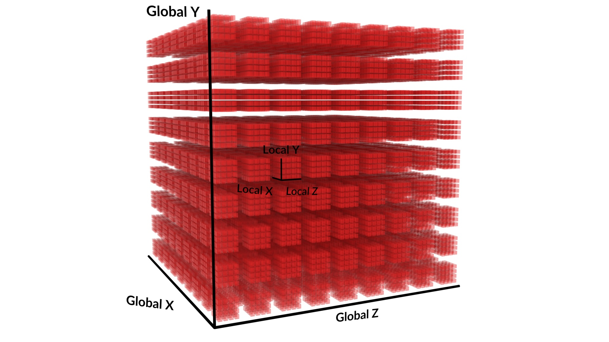

# Proiect Boids

## Idee generala

Boids este un program de viață artificială, dezvoltat de Craig Reynolds în 1986, care simulează comportamentul păsărilor și mișcările de grup aferente. Lucrarea sa pe această temă a fost publicată în 1987 în lucrările conferinței ACM SIGGRAPH. Denumirea „boid” corespunde unei versiuni prescurtate a „bird-oid object”, care se referă la un obiect asemănător unei păsări. Modelul boid al lui Reynolds este un exemplu al unui concept general mai larg, pentru care au fost dezvoltate de atunci multe alte variante. Lucrarea lui Ichiro Aoki, strâns legată de aceasta, este demnă de menționat deoarece a fost publicată în 1982 - cu cinci ani înainte de lucrarea lui Reynolds despre boids.

Proiectul de față a fost creat pe ideea de Boid. Simularea Boids pare aleatoare și naturală prin faptul că devine foarte diferită în funcție de starea inițială a sistemului. Partea interesantă este că acest "randomness" apare din niște reguli foarte simple. Un alt exemplu de astfel de sistem este un pendul dublu:

    </img>

După cum se poate vedea, parametrii inițiali, ce diferă foarte puțin, ajung la rezultate foarte diferite.

## Principii de funcționare

Pentru a înțelege comportamentul boizilor este necesar să înțelegem regulile fundamentale:
**1. Separation (separație)**  
**2. Alignment (aliniere)**  
**3. Cohesion (coeziune)**  

### 1. Separation (separație)

Separația este folosită pentru a încerca să facem ca boizii să nu se izbească între ei.

    </img>

### 2. Alignment (aliniere)

Alinierea este necesară pentru a crea stoluri în care boizii să încerce să meargă în aceeași direcție.

    </img>

### 3. Cohesion (coeziune)

Coeziunea împinge boizii să creeze stoluri în care fiecare dintre ei încearcă să ajungă în centru, fiind opriți de către separație din a se izbi unii cu alții.

    </img>

## Implementare

Problema pe care am încercat să o rezolv este a vitezei de calcul a forțelor dintre boizi (trebuie ca fiecare boid să verifice pozițiile tuturor celorlalți boizi, ceea ce face ca programul să aibă o complexitate de O(n2) în relație cu numărul de boizi). Prima soluție evidentă este să facem calculele secvențial pe CPU. Această abordare devine ineficientă foarte rapid cu număr mărit de boizi. Soluția acestei probleme folosită de mine a fost utilizarea puterii de calcul în paralel al GPU-ului (CPU-ul meu Ryzen 9 9950x are 16 core-uri, pe când GPU-ul RTX 4080 Super are 10240).

## Teorie

### Compute shader

Un compute shader este pur și simplu cod ce rulează pe GPU. El este scris pentru rularea sa în paralel. Codul se scrie în hlsl (high level shader language), iar în acesta este descrisă o funcție principală:

    [numthreads(x,y,z)]
    void Main (uint3 id : SV_DispatchThreadID)

Funcția principală descrie un grup de lucru. Acest grup are un x, y și un z. Astfel, ca o matrice de funcții, rulează x*y*z de fire de execuție în paralel și fiecăruia îi este asociat un id. Acest id este dat fiecărei funcții prin parametrul id de mai sus (uint3 înseamnă un struct de 3 unsigned int: id.x, id.y, id.z).  

Când este pornit un compute shader se specifică cât de multe grupuri de lucru vor fi pornite prin comanda:

    computeShader.Dispatch(kernel, xGroups, yGroups, zGroups);

Kernel este numărul atribuit funcției din compute shader, iar xGroups, yGroups, zGroups specifică cât de multe grupuri vor fi lansate. Numerotarea lor se va face după graficul de mai jos cu coordonatele lor globale.

    </img>

## Fișiere: imagine de ansamblu

### /Assets/Boids/Scripts/Boids.cs

Fișierul Boids.cs rulează pe CPU. El este necesar deoarece GPU-ul nu poate interacționa cu Game Object-uri (boizii) și funcțiile game engine-ului în general. Setările importante comportamentului boizilor sunt localizate în struct-ul BoidBehaviour ce este creat ca un câmp serializabil (este important pentru a putea schimba valorile variabilelor din Unity și nu din cod în sine pentru a itera asupra comportamentului repede). Majoritatea codului de aici se axează pe setarea mediului atunci când se pornește programul: boizi (numărul lor, comportamentul) și interacțiunea lor cu pereții. Partea importantă se întâmplă în **DispatchComputeShader** și **MoveBoids**.

**DispatchComputeShader**  
Aici sunt încărcate de pe CPU pe GPU pozițiile boizilor, vitezele lor și un vector de float-uri random (putea fi făcut și cu o funcție de hashing pe GPU). Apoi este pornit compute shader-ul de pe GPU și sunt luate înapoi forțele calculate pe acesta ce trebuie exercitate.

**MoveBoids**  
În această funcție este preluat vectorul de forțe și sunt aplicate pe fiecare boid.

 

### /Assets/Boids/Scripts/BoidCompute.compute

Dat fiind că boizii sunt numerotați crescător de la primul, avem nevoie să numerotăm și fiecare fir de execuție de pe GPU. În partea de teorie am discutat despre cum sunt date id-urile fiecărui fir de execuție. Astfel grupul principal va avea mărimea pe y și z de 1, iar pe x am ales 64. Acest număr a fost ales din cauza hardware-ului de pe GPU-uri. Hardware-ul GPU conține unități de calcul care rulează întotdeauna o anumită cantitate fixă de fire în același timp. Acestea sunt cunoscute sub numele de warp-uri sau wavefront-uri. Dacă numărul de fire dintr-un grup este mai mic decât dimensiunea warp, unele fire vor rula inactiv, pierzând timp. Dacă, în schimb, cantitatea de fire depășește dimensiunea, atunci GPU va utiliza mai multe warp-uri pe grup. În general, 64 de fire este o valoare implicită bună, deoarece aceasta corespunde dimensiunii warp a GPU-urilor AMD, în timp ce pentru GPU-urile NVidia este de 32, astfel încât acestea din urmă vor utiliza două warp-uri pe grup. În realitate, hardware-ul este mai complex și poate face mai mult cu grupurile de fire, dar acest lucru nu este relevant pentru graficul nostru simplu.

În acest fișier se calculează forțele boizilor. Fiecare instanță de funcție ce rulează folosește variabila **id.x** pentru a cunoaște pe care boid trebuie să lucreze.

## Fișiere în detaliu

### /Assets/Boids/Scripts/Boids.cs

Programul începe în funcția **Awake** în care se caută numărul asociat kernelului compute shader-ului creat.

    kernel = computeShader.FindKernel("CSMain");

Așa poate fi găsit compute shader-ul deoarece în BoidCompute.compute am setat numele acestuia printr-un pragma.

    #pragma kernel CSMain

Următoarea funcție ce este chemată este **OnEnable**. Funcția aceasta este chemată la începutul rulării sau atunci când se face o schimbare din editor a numărului boizilor sau poziția pereților din componentă.

    </img>

Atunci când se schimbă doar comportamentul boizilor, nu este necesară rularea funcției **OnEnable** deoarece noile valori pot fi transmise GPU-ului fără probleme.

    computeShader.SetFloat(forwardWeightID, boidBehaviour.forwardWeight);

Totuși, când se schimbă numărul de boizi, nu se poate doar retransmite numărul lor schimbat deoarece fiecărui boid îi este asociat mai multe float-uri din diferite buffer-e (vectori de pe GPU). 

    gpuPositions = new ComputeBuffer(numberOfBoids, sizeof(float) * 2);

Problema ce o întâmpinăm este că pe GPU nu există vectori dinamici, astfel buffer-ele trebuie marcate ca fiind spațiu liber:

    gpuPositions.Dispose();

Și apoi realocate și asociate cu buffer-ele din compute shader.

    computeShader.SetBuffer(kernel, positionsID, gpuPositions);

Pentru a seta un buffer este necesară aflarea ID-ului acestui buffer de pe GPU. Aici este necesar numele buffer-ului, deoarece ID-ul este generat de o funcție hash în funcție de acesta:

    int positionsID = Shader.PropertyToID("_Positions");

Numele trebuie să fie același ca cel setat pe GPU:

    RWStructuredBuffer<float2> _Positions;
 
După ce avem id-urile acestor proprietăți, ne mai trebuie și id-ul kernelului în care trimitem datele:

    kernel = computeShader.FindKernel("CSMain");

Numele este setat în fișierul .compute. La începutul fișierului trebuie să adăugăm:

    #pragma kernel CSMain

Acest lucru ne spune cum să căutăm acest kernel specific. 

Acum că avem ID-ul kernelului și ID-ul proprietăților, putem începe să atribuim vectorilor cu:

    computeShader.SetBuffer(kernel, forcesID, gpuForces);

Și pentru variabile cu:

    computeShader.SetFloat(forwardWeightID, boidBehaviour.forwardWeight);
    computeShader.SetBool("_Noise", boidBehaviour.noise);

Acum că avem valorile încărcate, putem porni compute shader-ul.

### /Assets/Boids/Scripts/BoidsCompute.compute

Aici, sarcina noastră este să începem implementarea regulilor pe care le-am discutat la începutul acestei documentații. 

Un bonus pe care l-am adăugat a fost faptul că am vrut să ofer boid-ului un câmp vizual. Cel mai simplu mod pe care l-am găsit pentru a crea câmpul vizual este să iau cosinusul dintre vectorul de mișcare și vectorul de la boidul nostru la celălalt.

    float CosineAngleBetweenTwoVectors(float2 v1, float2 v2)
    {
        float a = v1.x * v2.x + v1.y * v2.y;
        float b = length(v1) * length(v2);
        
        return a/b;
    }

Cu cosinusul scăzând odată cu mărirea unghiului, putem pune o limită la ce valoare vom lua în considerare alți boizi.

Mai întâi aplicăm o forță înainte pentru a avea întotdeauna boidul nostru în mișcare înainte:

    force += _ForwardWeight * directionVec;

Apoi adăugăm zgomotul aleator din vector:

    force += _NoiseWeight * MakeVecAnglRel(_NoiseAngle[id], directionVec) * _Noise;

Pentru separație, considerăm pozițiile boizilor ca vectori și calculăm vectorul de la ceilalți boizi la al nostru, apoi îi adunăm pe toți și îi scalăm în jos, adăugându-i la variabila de forță:

    for(...)
    {
        ...
        separation += relativeVec / length(relativeVec) * _ViewRadius * easeInCubic(distP);
    }
    ...
    separation /= interactions;
    force += separation * _SeparationWeight;

For cohesion we take the mean of the positions of the other boids around us and then we take the relative vector to see towards what direction we want to go to and we add it to the force variable.

    for(...)
    {
        ...
        cohesion += _Positions[i];
    }
    ...
    cohesion /= interactions;
    force += (cohesion - _Positions[id]) * _CohesionWeight;

The last one, alignment, poses a problem: if the 2 boids we want to align with have the angles -179 and 179 the mean should be +-180, but it is 0. Given that 0 is oriented up, that makes all boids slowly, but surely gravitate towards the top of the screen. That is to be avoided. A solution that I found was using quaternions.  

A quaternion is a 4 dimensional number that describes rotation and it should resolve this issue, although after a few iterations i could't get it running. The main problem with quaternions is that they aren't intuitive and it's very hard to debug code that uses them.  

After some thinking i realized that a easier solution exists: taking the directional vectors of the other boids and taking the average of them. That should give us the average direction that all of the boids in the flock around the boid. 

At last we add this force to all others and we normalize the force variable and add it to a vector to give back to the CPU.

    for(...)
    {
        ...
        avgDirectionVec += normalize(_Velocities[i]);
    }
    ...
    avgDirectionVec /= interactions;
    if (avgDirectionVec.x != 0 || avgDirectionVec.y != 0)
    {
        avgRotation = degrees(atan2(avgDirectionVec.y, avgDirectionVec.x)) - 90.f;
        force += _AlignmentWeight * float2(-sin(radians(avgRotation)), cos(radians(avgRotation)));
    }

## Possible improvements

