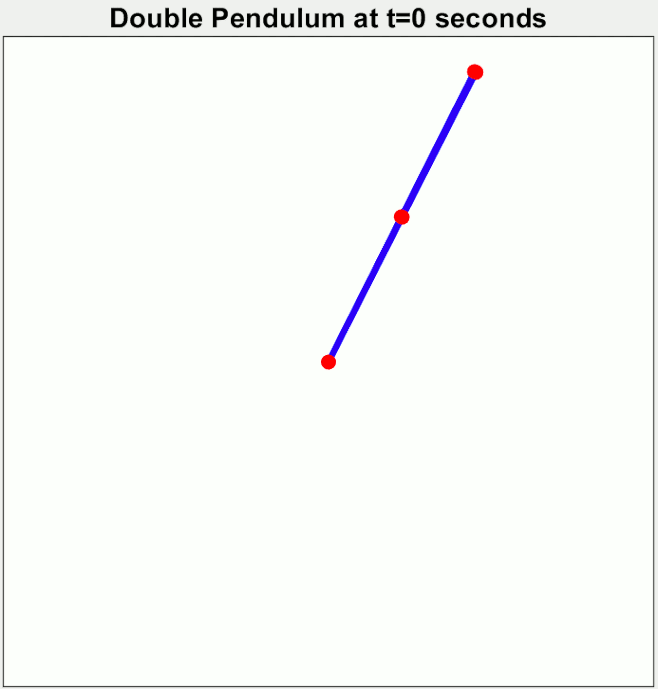

# Proiect Boids

## Idee generala

Boids este un program de viață artificială, dezvoltat de Craig Reynolds în 1986, care simulează comportamentul păsărilor și mișcările de grup aferente. Lucrarea sa pe această temă a fost publicată în 1987 în lucrările conferinței ACM SIGGRAPH. Denumirea „boid” corespunde unei versiuni prescurtate a „bird-oid object”, care se referă la un obiect asemănător unei păsări. Modelul boid al lui Reynolds este un exemplu al unui concept general mai larg, pentru care au fost dezvoltate de atunci multe alte variante. Lucrarea lui Ichiro Aoki, strâns legată de aceasta, este demnă de menționat deoarece a fost publicată în 1982 - cu cinci ani înainte de lucrarea lui Reynolds despre boids.

Proiectul de fata a fost creat pe ideea de Boid. Simularea Boids pare aleatoare si naturala prin faptul ca devine foarte diferita in functie de starea initiala a sistemului. Partea interesanta este ca acest "randomness" apare din niste reguli foarte simple. Un alt exemplu de astfel de sistem este un pendul dublu:

    </img>

Dupa cum se poate vedea, parametrii initiali, ce difera foarte putin, ajung la rezultate foarte diferite.

## Principii de functionare

Pentru a intelege comportamentul boizilor este necesar sa intelegem regulile fundamentale:
**1. Separation (separatie)**
**2. Alignment (aliniere)**
**3. Cohesion (coeziune)**

### 1. Separation (separatie)

Separatia este folosita pentru a incerca sa facem ca boizii sa nu se izbeasca intre ei.

    </img>

### 2. Alignment (aliniere)

Alinierea este necesara pentru a crea stoluri in care boizii sa incerce sa mearga in aceeasi directie.

    </img>

### 3. Cohesion(coeziune)

Coeziunea impinge boizii sa creeze stoluri in care fiecare dintre ei incearca sa ajunga in centru, fiind opriti de catre separatie din a se izbi unii cu altii.

    </img>

## Implementare

Problema care am incercat sa o rezolv este a vitezei de calcul a fortelor dintre boizi (trebuie ca fiecare boid sa verifice pozitiile tuturor celorlalti boizi ceea ce face ca programul sa aiba o complexitate de O(n2) in relatie cu numarul de boizi). Prima solutie evidenta este sa facem calculele secvential pe CPU. Aceasta abordare devine ineficienta foarte rapid cu numar marit de boizi. Solutia acestei probleme folosita de mine a fost utilizarea puterii de calcul in paralel al GPU-ului (CPU-ul meu Ryzen 9 9950x are 16 core-uri, pe cand GPU-ul RTX 4080 Super are 10240).

## Teorie

### Compute shader

Un compute shader este pur si simplu cod ce ruleaza pe GPU. El este scris pentru rularea sa in paralel. Codul se scrie in hlsl(high level shader language), iar in acesta este descrisa o functie principala:

    [numthreads(x,y,z)]
    void Main (uint3 id : SV_DispatchThreadID)

Functia principala descrie un grup de lucru. Acest grup are un x, y si un z. Astfel, ca o matrice de functii, ruleaza x*y*z de fire de executie in paralel si fiecaruia ii este asociat un id. Acest id este dat fiecarei functii prin parametrul id de mai sus (uint3 inseamna un struct de 3 unsigned int: id.x, id.y, id.z).  

Cand este pornit un compute shader se specifica cat de multe grupuri de lucru vor fi pornite prin comanda:

    computeShader.Dispatch(kernel, xGroups, yGroups, zGroups);

Kernal este numarul atribuit functiei din compute shader, iar xGroups, yGroups, zGroups specifica cat de multe grupuri vor fi lansate. Numerotarea lor se va face dupa graficul de mai de jos cu coordonatele lor globale.

    </img>

## Probleme intampinate
LOREM IPSUM DOLOR

## Fișiere: imagine de ansamblu

### /Assets/Boids/Scripts/Boids.cs

Fisierul Boids.cs ruleaza pe CPU. El este necesar deoarece GPU-ul nu poate interactiona cu Game Object-uri (boizii) si functiile game engine-ului in general. Setarile importante comportamentului boizilor sunt localizate in struct-ul BoidBehaviour ce este creat ca un camp serializabil (este important pentru a putea schimba valorile variabilelor din unity si nu din cod in sine pentru a itera asupra comportamentului repede). Majoritatea codului de aici se axeaza pe setarea mediului atunci cand se porneste programul: boizi (numarul lor, comportamentul) si interactiunea lor cu peretii. Partea importanta se intampla in **DispatchComputeShader** si **MoveBoids**.

**DispatchComputeShader**
Aici sunt incarcate de pe cpu pe gpu pozitiile boizilor, vitezele lor si un vector de float-uri random (putea fi facut si cu un hashing function pe GPU). Apoi este pornit compute shader-ul de pe GPU si sunt luate inapoi fortele calculate pe acesta ce trebuie exercitate.

**MoveBoids**
In aceasta functie este preluat vectorul de forte si sunt aplicate pe fiecare boid.

 

### /Assets/Boids/Scripts/BoidCompute.compute

Dat fiind ca boizii sunt numerotati crescator de la primul avem nevoie sa numerotam si fiecare fir de executie de pe GPU. In partea de teorie am discutat despre cum sunt date id-urile fiecarui fir de executie. Astfel grupul principal va avea marimea pe y si z de 1, iar pe x am ales 64. Acest numar a fost ales din cauza hardware-ului de pe GPU-uri. Hardware-ul GPU conține unități de calcul care rulează întotdeauna o anumită cantitate fixă de fire în același timp. Acestea sunt cunoscute sub numele de warp-uri sau wavefront-uri. Dacă numărul de fire dintr-un grup este mai mic decât dimensiunea warp, unele fire vor rula inactiv, pierzând timp. Dacă, în schimb, cantitatea de fire depășește dimensiunea, atunci GPU va utiliza mai multe warp-uri pe grup. În general, 64 de fire este o valoare implicită bună, deoarece aceasta corespunde dimensiunii warp a GPU-urilor AMD, în timp ce pentru GPU-urile NVidia este de 32, astfel încât acestea din urmă vor utiliza două warp-uri pe grup. În realitate, hardware-ul este mai complex și poate face mai mult cu grupurile de fire, dar acest lucru nu este relevant pentru graficul nostru simplu.

In acest fisier se calculeaza fortele boizilor. Fiecare instanta de functie ce ruleaza foloseste variabila **id.x** pentru a cunoaste pe care boid trebuie sa lucreze.

## Fisiere in detaliu

### /Assets/Boids/Scripts/Boids.cs

Programul incepe in functia **Awake** in care se cauta numarul asociat kernelului compute shader-ului creat.

    kernel = computeShader.FindKernel("CSMain");

Asa poate fi gasit compute shader-ul deoarece in BoidCompute.compute am setat numele acestuia printr-un pragma.

    #pragma kernel CSMain

Urmatoarea functie ce este chemata este **OnEnable**. Functia aceasta este chemata la inceputul rularii sau atunci cand se face o schimbare din editor a numarului boizilor sau pozitia peretilor din componenta.

    </img>

Atunci cand se schimba doar comportamentul boizilor, nu este necesara rularea functiei **OnEnable** deoarece noile valori pot fi transmise gpu-ului fara probleme.

    computeShader.SetFloat(forwardWeightID, boidBehaviour.forwardWeight);

Totusi cand se schimba numarul de boizi nu se poate doar retransmite numarul lor schimbat deoarece fiecarui boid ii este asociat mai multe float-uri din diferite buffer-uri (vectori de pe GPU). 

    gpuPositions = new ComputeBuffer(numberOfBoids, sizeof(float) * 2);

Problema ce o intampinam este ca e GPU nu exista vectori dimanici, astfel buffer-ele trebuie marcate ca fiind spatiu liber:

    gpuPositions.Dispose();

Si apoi realocate si asociate cu buffer-ele din compute shader.

    computeShader.SetBuffer(kernel, positionsID, gpuPositions);

Pentru a seta un buffer este necesara aflarea ID-ului acestui buffer de pe GPU. Aici este necesar numele buffer-ului, deoarece ID-ul este generat de o functie hash in functie de acesta:

    int positionsID = Shader.PropertyToID("_Positions");

Numele trebuie sa fie acelasi ca cel setat pe GPU:

    RWStructuredBuffer<float2> _Positions;